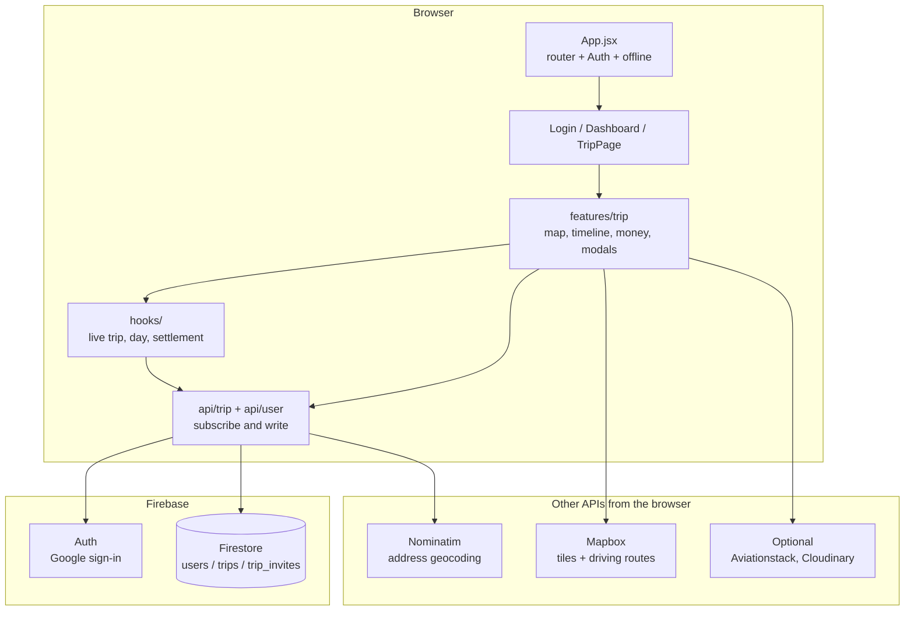
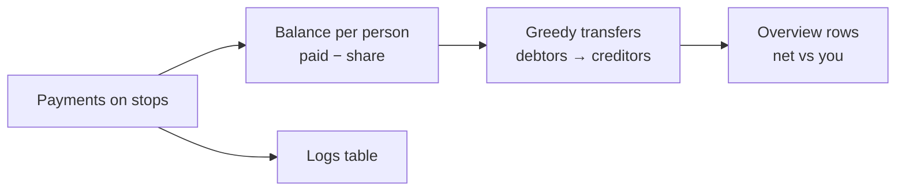

# How this app works

Neel's Travel Book is a **collaborative trip planner**: signed-in people create a trip, invite others, and edit the same itinerary on a map and a day timeline. There is no custom backend. The browser talks to **Firebase** (Google sign-in + Firestore) and a few public APIs (geocoding, driving routes, optional flight lookup, photo upload).

For URL/router basics, see [Routing.MD](./Routing.MD). This page is the rest of the system.

## Architecture

There is no app server. The Vite/React client talks to Firebase and a few HTTP APIs. `src/App.jsx` wraps the tree in the router, auth, and an offline flag. `/dashboard` and `/trip/:tripId` sit behind `ProtectedRoute` (must be signed in). `src/pages/Trip.jsx` only re-exports `src/features/trip/TripPage.jsx`.



A typical edit: UI in `features/trip` → function in `src/api/trip` → Firestore trip document → `useTripDocument` snapshot → map, timeline, and money all re-render from the same `trip` object.

On sign-in, `AuthContext` waits for Firebase Auth, then `syncUserWithFirestore` upserts `users/{uid}`. Google popup is the default; if the browser blocks it, login falls back to a full-page redirect and still returns to the original URL (so invite links keep `?tripId=`).

## Folders

| Path | Role |
|------|------|
| `src/pages/` | Route screens: Login, Dashboard, Trip (thin wrapper) |
| `src/features/trip/` | The trip workspace: page, map, timeline, modals |
| `src/api/` | Firebase + trip/user writes and listeners. Import trip helpers from `src/api/trip` (the index), not individual files |
| `src/hooks/` | Shared trip hooks (live document, selected day, money math, …) |
| `src/utils/` | Pure helpers: times, dates, money split, Mapbox route fetch |
| `src/context/` | `useAuth()`, `useOffline()` |
| `src/components/` | Layout, header, shared buttons/inputs, create/add-stop modals |
| `src/styles/` | Color tokens (`tokens.css`) and login/dashboard CSS (`ui.css`) |
| `tests/` | Vitest files mirroring `src/` (e.g. `tests/utils/…`) |
| `firestore.rules` | Who can read/write what. Deploy with the Firebase CLI or console |

Trip-only CSS lives in `src/features/trip/trip.css`. Shared modal/form chrome is in `src/App.css`.

## Screens

**Login (`/login`)** — Google sign-in. Then `/dashboard`.

**Dashboard (`/dashboard`)** — Your trip list. Create a trip (name, destination, dates) or join with a code. An invite link is `/dashboard?tripId=…` and joins after sign-in. The list stays live via `subscribeToUserTrips()`.

**Trip (`/trip/:tripId`)** — The workspace. `TripPage` loads the trip, then renders:

- **Toolbar** — add stop, day title, share, clock (timeline), settings
- **Map** — pins, driving line, flights as dotted arcs
- **Timeline** (clock) — hours of the selected day; drag to reorder
- **Stop card** — details / edit when a pin or pill is selected (floating card on desktop, modal on small screens)
- **Island** — Flights, lodging, money

Edits go through `src/api/trip` and show up for everyone on that trip because they all listen to the same document.

## Data (Firestore)

Three collections:

**`users/{uid}`** — Profile plus `trips: string[]` (ids of trips you belong to).

**`trips/{tripId}`** — The whole trip, including the itinerary, in **one document**:

- `name`, `destination`, `startDate` / `endDate` (`YYYY-MM-DD`)
- `creatorId`, `participants` (user ids), `participantNames` (id → display name so we don’t have to read other users’ docs)
- `inviteCode`, `description`
- `itinerary`: array of days `{ date, title?, stops: [...] }`

A **stop** is `{ id, title, notes, location, stopTime, timestampHour, latitude, longitude, createdBy, stopType, members, metadata, payments }`.

- `stopType`: `regular` | `flight` | `lodging`
- `timestampHour` is 0–23; the timeline groups by hour
- `payments` live **on the stop**, not in a separate collection

**`trip_invites/{code}`** — `{ code, tripId, createdBy }`. Lets someone look up a trip by code without listing every trip.

### Why one trip document?

One snapshot updates the map, timeline, money, and settings together. That is simple. The cost is that two people editing the same trip at once can overwrite each other, and a huge itinerary makes the document large. If that becomes a problem, stops would move to a subcollection.

## Live updates

`subscribeToTripById` (`src/api/trip/reads.js`) uses Firestore `onSnapshot`. `useTripDocument` puts that into React state and picks the first day if none is selected. Offline, it can show a last-known copy from IndexedDB (`tripReadCache`) as read-only.

Writes (`updateStopInTrip`, payments, settings, …) patch the trip document. Everyone’s listener fires. There is no extra websocket layer.

`normalize.js` runs on the way in so older documents still have a predictable shape.

## Trip page (where the complexity is)

`TripPage.jsx` is the orchestrator. It does not fetch with `useEffect` + `getDoc` itself; hooks do:

| Hook | What it does |
|------|----------------|
| `useTripDocument` | Live trip object |
| `useTripDaySelection` | Selected day + that day’s stops |
| `useDestinationCoordinates` | Geocode the trip destination so the empty map has a center |
| `useDebouncedDrivingRoute` | Mapbox road line for the current stops (waits briefly so Firestore chatter doesn’t spam the API) |
| `useTripPaymentAnalytics` | Totals and “who owes whom” |
| `useTripSpecialStopGroups` | Flights / lodging grouped for their modals |
| `useTripModalController` | Which modal is open |
| `useStopSheetHeight` / `useTripTimelineResize` | Layout: stop-card inset, mobile map/timeline split |

Map and timeline both read the same `trip` + selected day. Selecting a stop is just state; the map flies to it and the card opens.

**Map (`MapView`)**

- Leaflet for pins, popups, and polylines
- Basemap: Mapbox vector tiles with an in-repo Voyager-like style (`map/voyagerStyle.js` + `MapboxVoyagerLayer`). Optional override: `VITE_MAPBOX_STYLE`
- Roads: Mapbox Directions (`src/utils/mapboxRoute.js`). Needs `VITE_MAPBOX_ACCESS_TOKEN`. No token → straight lines between stops
- Addresses: OpenStreetMap Nominatim (`src/api/trip/geocoding.js`)

**Flights / lodging**

Modals write special stops onto the right days (flight lookup can use Aviationstack if `VITE_AVIATIONSTACK_API_KEY` is set). Deleting a flight or stay removes those stops across the trip.

## Money and settlement

Money is **not** a bank and it does **not** record that someone paid someone back. It only answers: given what was logged on stops, who is up and who is down, and a small set of transfers that would zero everyone out.

Code: `useTripPaymentAnalytics` builds the numbers; `paymentSplitMembers.js` decides who shares each payment; `paymentSettlement.js` turns balances into transfers. The Money modal has **Overview** (vs you) and **Logs** (every payment).

### Where a payment lives

Each payment sits on a **stop**: `{ id, payerId, payerName, amount, reason, createdAt?, splitMembers? }`. Amount must be finite and `> 0`. There is no payments collection.

`useTripPaymentAnalytics` flattens every stop on every day into one list (duplicate payment ids are skipped).

### Who shares each payment

`resolvePaymentSplitMembers(splitMembers, tripParticipants, payerId)`:

- `splitMembers` missing or empty → **everyone currently on the trip** (not “people on that stop”)
- an explicit id list → those people, minus anyone who left the trip
- no participants at all → fall back to the payer alone

Each person on that list owes `amount / splitMembers.length`. The payer is credited the full `amount`.

### Balances

Start every participant at `0`. For each valid payment:

1. Add `amount` to the payer
2. Subtract `amount / n` from each person in the split (including the payer if they are in the split)

After all payments, a person’s balance is **what they paid minus their assigned share**.

- **Positive** — the group owes them (they covered more than their share)
- **Negative** — they owe the group
- **Zero** — even

“Your assigned share” on Overview is the sum of those `amount / n` slices where you were in the split. “Total trip spend” is the sum of payment amounts.

### Settle-up (greedy)

Balances always sum to about zero. `computeGreedySettlementTransfers` walks two lists — people who owe, people who are owed — and matches the next debtor to the next creditor for `min(what they still owe, what the creditor is still owed)`. Amounts are rounded to cents. Dust smaller than `SETTLEMENT_EPS` (`0.005`) is ignored.

That plan is **one** valid way to settle. It is not unique (A→B vs A→C→B can both work). Overview then, **for you only**, nets the transfers between you and each other person (`netSettlementBetweenUserAndOther`). Positive = they should pay you; negative = you should pay them.

It does not create new payment records when someone “settles.” It is a suggestion from current logs.



### Example

Alex, Blair, Casey. Alex logs a $60 dinner split with everyone.

| Person | Paid | Share | Balance |
|--------|------|-------|---------|
| Alex | 60 | 20 | **+40** |
| Blair | 0 | 20 | **−20** |
| Casey | 0 | 20 | **−20** |

Suggested transfers: Blair → Alex $20, Casey → Alex $20.

If you are Alex, Overview says Blair owes you $20 and Casey owes you $20. If you are Blair, it says you owe Alex $20.

Add a second payment: Blair logs $15 drinks split with everyone. Shares are $5 each.

| Person | Running balance |
|--------|-----------------|
| Alex | +40 − 5 = **+35** |
| Blair | −20 + 15 − 5 = **−10** |
| Casey | −20 − 5 = **−25** |

Greedy: Casey pays Alex $25, Blair pays Alex $10. Same idea — people in the hole pay people who are ahead until balances are ~0.

### What this is not

- Not “Blair already paid Alex back” — logging a repayment as a payment would change the balances again
- Not weighted splits (50/50 only in the sense of equal among the selected people)
- Not stop-membership by default on old payments — those split across the **current trip roster**


Trips are not public. You can read/update a trip only if your uid is in `participants`. Join works like this:

1. Client reads `trip_invites/{code}` → `tripId`
2. Client adds itself to `trips/{id}.participants` and `users/{uid}.trips`

The creator can remove people or delete the trip (that delete also strips the trip id from every member’s `users.trips` and removes the invite doc). Rules for all of this are in `firestore.rules` — deploy them or Delete trip / join will fail with permission errors.

```bash
firebase deploy --only firestore:rules
```

## Running it

```bash
npm install
npm run dev          # Vite, usually http://localhost:5173
npm test             # Vitest
npm run lint
```

Put secrets in `.env` (Vite only exposes names starting with `VITE_`). Restart the dev server after changing them.

| Variable | Used for |
|----------|----------|
| `VITE_FIREBASE_*` | Auth + Firestore (required) |
| `VITE_MAPBOX_ACCESS_TOKEN` | Map style + driving routes |
| `VITE_MAPBOX_STYLE` | Optional Mapbox Studio style URL |
| `VITE_AVIATIONSTACK_API_KEY` | Flight lookup |
| `VITE_CLOUDINARY_*` | Stop photo uploads |

Add `localhost` under Firebase Auth → Authorized domains.

## Design choices (short)

- **Itinerary in the trip document** — easy realtime; weak under heavy concurrent edits
- **Hour, not exact minute, on the timeline** — simpler grouping; less precision
- **Names copied onto the trip** — Money/settings work without reading other `users` docs
- **Client-side Mapbox + Nominatim** — no server of our own; depends on tokens and those providers’ limits
- **Offline** — edits are not queued; the UI blocks saves and may show a cached trip

## If you want to change X

| Change | Start here |
|--------|------------|
| New screen / URL | `src/App.jsx`, then a file under `src/pages/` |
| Sign-in behavior | `src/context/AuthContext.jsx`, `src/pages/Login.jsx` |
| Create / join / delete trip | `src/api/trip/lifecycle.js`, `src/pages/Dashboard.jsx` |
| Stop create/edit/delete, payments | `src/api/trip/itinerary.js` |
| Money totals / who owes whom | `src/hooks/useTripPaymentAnalytics.js`, `src/utils/paymentSettlement.js`, `src/utils/paymentSplitMembers.js` |
| Map look or route line | `src/features/trip/map/voyagerStyle.js`, `src/utils/mapboxRoute.js` |
| Timeline hours / drag | `src/features/trip/components/ItineraryView.jsx`, `src/utils/stopTime.js` |
| Who can read a trip | `firestore.rules` |
| Colors | `src/styles/tokens.css` |
